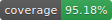

# Quant Risk Platform



Quant Risk Platform is a C++20 and Python analytics library for pricing, risk, stress testing, historical VaR,
Expected Shortfall, VaR/ES contributions, P&L explain, and persisted run reporting across rates, FX, credit,
commodities, and equities.

The C++ core owns the analytics. Python is the interface layer for demos, orchestration, notebooks, and dashboards.

## What You Can Do

- Load normalized market snapshots, portfolios, and scenario sets from JSON.
- Build rates curves and reusable market state with QuantLib underneath.
- Price multi-asset portfolios across supported rates, FX, credit, commodity, and equity products.
- Compute deterministic sensitivities such as PV01, CS01, FX delta, FX vega, and option Greeks where supported.
- Replay historical and hypothetical stress scenarios.
- Run historical VaR and Expected Shortfall, including contributions by trade, book, strategy, currency, asset class,
  and risk factor.
- Explain P&L with carry, market move, realized deposit maturity cash, residual reconciliation, and persisted
  components.
- Run C++-managed LSMC and dynamic-programming exercise valuation for American options, Bermudan swaptions, callable
  bonds, commodity swing contracts, and gas storage.
- Reuse a C++-owned revaluation session from Python for fast quote updates, scenario revaluation, dependency-graph
  diagnostics, and restored market checks without exposing raw QuantLib handles.
- Persist market data, portfolios, scenarios, valuation runs, risk runs, HVaR runs, and P&L explain runs in SQLite.
- Use the platform through Python bindings, a C++ CLI, or the provided scripts.

## Documentation Split

This repository follows a common open-source documentation pattern: the root `README.md` is user-facing, while
development and maintenance workflows live in a separate development document.

- [USAGE.md](USAGE.md): practical installation, demos, Python examples, CLI usage, data layout, and outputs.
- [DEVELOPMENT.md](DEVELOPMENT.md): build presets, tests, coverage, style, docs, branching, and PR checklist.
- [QUICKSTART.md](QUICKSTART.md): compact build and smoke-test reference.
- [docs/](docs/README.md): detailed architecture, market-data, product, model, risk, and implementation handbook.
- [scripts/README.md](scripts/README.md): script-by-script automation reference.

## Quick Install And Demo

Clone the repository, then use the platform scripts. They configure CMake, use vcpkg for C++ dependencies, and build the
Python extension when the selected preset enables it.

### Windows PowerShell

```powershell
git clone https://github.com/b-io/quant-risk-platform.git
cd quant-risk-platform

# Optional but recommended for MSVC terminals.
copy msvc.env.cmd.example .env.cmd
# Edit .env.cmd if your dev tools live outside the default path.

.\scripts\install.ps1
.\scripts\build.ps1
.\scripts\test.ps1

uv sync --project python --extra dashboard --extra optimization
uv run --project python python python\examples\demo_platform.py
```

### Linux Or macOS

```bash
git clone https://github.com/b-io/quant-risk-platform.git
cd quant-risk-platform

cp gcc.env.sh.example .env.sh
# Edit .env.sh if your dev tools live outside the default path.

./scripts/install.sh
./scripts/build.sh
./scripts/test.sh

uv sync --project python --extra dashboard --extra optimization
uv run --project python python python/examples/demo_platform.py
```

## Python Example

After building the `quant_risk_platform` extension, use it directly from Python:

```python
from pathlib import Path
import sys

project = Path.cwd()
sys.path.insert(0, str(project / "build" / "dev" / "python" / "RelWithDebInfo"))

import quant_risk_platform as qrp

market = qrp.load_market(str(project / "data" / "market" / "demo_market.json"))
portfolio = qrp.load_portfolio(str(project / "data" / "portfolios" / "demo_portfolio.json"))

valuation_results = qrp.price_portfolio(portfolio, market)
total_npv = sum(result.npv for result in valuation_results)

print(f"Portfolio: {portfolio.portfolio_id}")
print(f"Trades:    {len(portfolio.trades)}")
print(f"Total NPV: {total_npv:,.2f}")
```

For repeated shocks, use the C++-owned revaluation session. It builds the market state and instruments once, then lets
Python update quotes and ask for new values:

```python
session = qrp.create_revaluation_session(portfolio, market)

base_total = session.total_npv()
quote_updates = {
    "EURUSD": 1.057875,
    "AAPL": 170.66,
    "USD_OIS_5Y": 0.0512,
}

graph = session.dependency_graph()
aapl_dependencies = session.dependencies_for_quote("AAPL")
preview = session.preview_quote_update_impact(quote_updates)
report = session.revalue_quote_update_impact(quote_updates, pnl_tolerance=1e-8)

top_moves = sorted(report.trade_diffs, key=lambda row: abs(row.pnl), reverse=True)[:5]

print(f"Base total:    {base_total:,.2f}")
print(f"Graph:         {graph.trade_count} trades, {graph.quote_count} quotes, {graph.dependency_count} links")
print("AAPL touches:  " + ", ".join(edge.trade_id for edge in aapl_dependencies[:5]))
print(f"Candidates:    {preview.potentially_affected_trade_count}")
print(f"Candidate P&L: {report.candidate_pnl:,.2f}")
for row in top_moves:
    marker = "*" if row.moved_above_tolerance else " "
    print(f"{marker} {row.trade_id:<32} {row.pnl:>12,.2f} via {row.dependency_quote_ids}")

print(f"Restored:      {session.total_npv():,.2f}")
```

Under the hood, the session owns QuantLib `SimpleQuote` handles, curves, pricing engines, and instruments in C++.
`apply_quote_updates(...)` mutates only the named quote handles. QuantLib's observer graph marks dependent curves and
instruments dirty, then recalculates lazily on the next NPV request from the changed market node upward through the
dependency chain. The portfolio is not reparsed, curves are not rebuilt from scratch, and Python never manages raw
QuantLib object lifetimes.

The diagnostic APIs are opt-in. `dependency_graph()` returns a read-only quote-to-trade snapshot for inspection,
`preview_*_impact(...)` uses the same lazy dependency index to answer which trades should be affected without repricing,
and `revalue_*_impact(...)` reprices only the structurally affected candidate trades before returning compact
before/after diff rows to Python.

Persistence is explicit. The `dependency_graph(...)`, `dependencies_for_*`, and `preview_*_impact(...)` APIs are
read-only diagnostics. The `revalue_*_impact(...)` and `revalue_scenario(...)` APIs compute in the current C++ session,
restore the base market state before returning, and do not write to SQLite. `apply_quote_updates(...)` and
`apply_scenario(...)` mutate only the current in-memory `RevaluationSession`; call `reset()` or create a new session to
return to the base state. Durable writes happen through the CLI/application persistence workflows: `import-market`,
`import-portfolio`, and `import-scenarios` store inputs, while `run-valuation`, `run-risk`, `run-pnl-explain`, and
`run-hvar` store analysis runs and results in `var/quant_risk_platform.sqlite`.

The full demo uses the same session API with factor bindings to apply the `GLOBAL_RISK_OFF` scenario, print quote-handle
moves, print a dependency-graph sample, preview potentially affected trades, show candidate-only before/after diffs, and
verify the reset value within valuation tolerance.

For scenario, risk, P&L explain, Monte Carlo, and VaR contribution examples, run:

```powershell
uv run --project python python python\examples\demo_platform.py
```

Use `--dashboard` to generate an optional Plotly HTML dashboard:

```powershell
uv run --project python python python\examples\demo_platform.py --dashboard
```

## CLI Example

The C++ CLI stores results in `var/quant_risk_platform.sqlite` by default.

```powershell
.\build\dev\qrp_cli.exe init-db
.\build\dev\qrp_cli.exe import-market data\market\demo_market.json
.\build\dev\qrp_cli.exe import-portfolio data\portfolios\demo_portfolio.json
.\build\dev\qrp_cli.exe import-scenarios data\scenarios\demo_scenarios.json

.\build\dev\qrp_cli.exe run-valuation --portfolio demo_portfolio --snapshot DEMO_MKT_2026_03_24
.\build\dev\qrp_cli.exe run-risk --portfolio demo_portfolio --snapshot DEMO_MKT_2026_03_24
.\build\dev\qrp_cli.exe run-pnl-explain --portfolio demo_portfolio --previous-snapshot DEMO_MKT_2026_03_24 --snapshot DEMO_MKT_2026_03_24
.\build\dev\qrp_cli.exe run-hvar --portfolio demo_portfolio --snapshot DEMO_MKT_2026_03_24 --scenarios demo_factor_scenarios
.\build\dev\qrp_cli.exe list
```

## Current Coverage

Implemented product coverage includes:

- rates: deposits, FRAs, interest-rate futures, vanilla swaps, OIS swaps, fixed-rate bonds, callable fixed-rate bonds,
  floating-rate notes, cap/floors, European swaptions, and Bermudan swaptions;
- FX: spot, forwards, swaps, NDFs, and options;
- credit: bonds, CDS, CDS indices, CDS options, and credit index options;
- equities: spot, forwards, futures, and options;
- commodities: spot, forwards, futures, future strips, futures options, calendar spread options, swing contracts, and gas
  storage contracts.

Implemented analytics include valuation, deterministic risk, reactive revaluation sessions with impact diagnostics,
historical stress, HVaR, VaR/ES contribution analytics, Monte Carlo simulation, C++-managed exercise and
dynamic-programming valuation paths, P&L explain, persistence, run reporting, and demo dashboards.

Known boundaries:

- Monte Carlo and parametric VaR contribution decomposition are not yet first-class outputs.
- Realized event-source integration does not yet cover every coupon, fixing, exercise, and settlement source.
- A reusable revaluation-session cache exists for quote and scenario workflows; a shared built-position cache across all
  analytics services is still a hardening area.
- Production controls, manifests, benchmark governance, and validation reports remain hardening areas.

## Repository Layout

```text
cpp/        C++ core, CLI, benchmarks, and pybind11 bindings
data/       demo market snapshots, portfolios, scenarios, and regression fixtures
docs/       architecture, market data, risk, asset-class, model, and implementation docs
python/     Python examples, dashboard, optimizer worker, and package metadata
scripts/    build, install, test, compute, inspect, and environment helpers
tests/      C++ unit/integration tests and Python worker tests
var/        local SQLite database and logs generated by scripts and CLI
```

## More Detail

- Start with [USAGE.md](USAGE.md) when you want to run or use the library.
- Use [DEVELOPMENT.md](DEVELOPMENT.md) when you want to change, test, or release the library.
- Use [docs/architecture/ARCHITECTURE.md](docs/architecture/ARCHITECTURE.md) for system design.
- Use [docs/risk/VAR.md](docs/risk/VAR.md) for VaR and Expected Shortfall conventions.
- Use [docs/asset-classes/INDEX.md](docs/asset-classes/INDEX.md) for product coverage by asset class.

## Disclaimer

This repository is a technical demonstration project intended for educational and professional portfolio purposes. It
is not investment advice and should not be used for production trading or risk management without additional
validation, controls, governance, and operational hardening.
