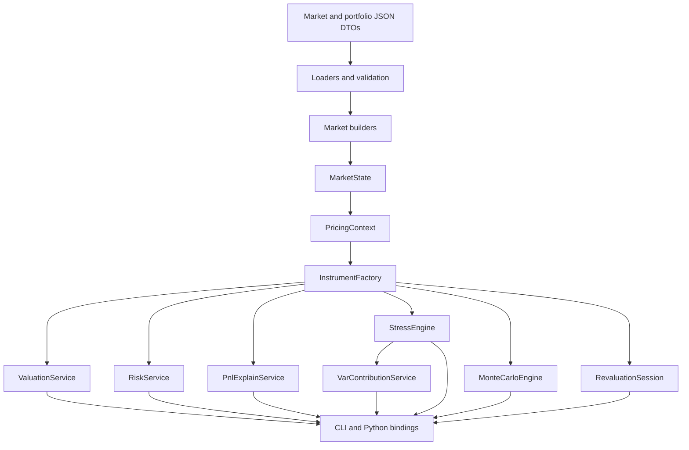
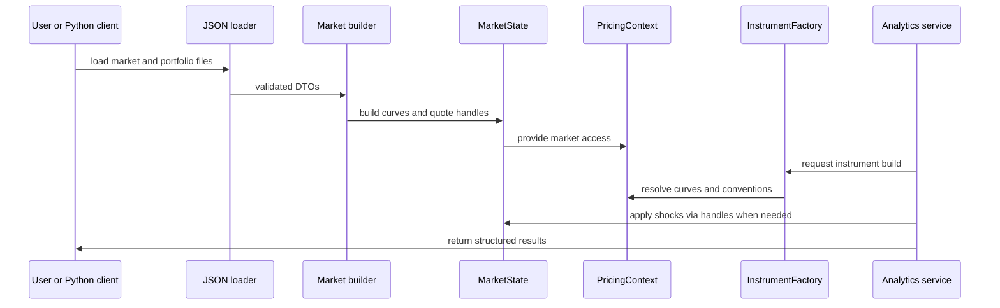
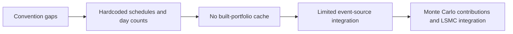

# Quant Risk Platform Architecture

This document is the **single design source of truth** for the platform architecture. It combines the previous
high-level and low-level notes and explains not only **what** the components are, but also **why** the design choices
were made.

## 1. Design goals

The target system is a production-shaped quantitative risk engine with the following properties:

- market-consistent valuation,
- reusable market objects and reactive quote handles,
- clear separation between market construction, instruments, and analytics,
- deterministic risk, historical stress, and Monte Carlo,
- scalable revaluation and parallel execution,
- application-level interfaces for CLI and Python.

## 2. High-level architecture

### Layering Rationale

- **DTOs** isolate external file formats from internal objects.
- **Loaders and validation** keep malformed payloads out of the engine.
- **Market builders** convert raw quotes and conventions into QuantLib term structures.
- **MarketState** owns reusable handles and curves.
- **PricingContext**: Resolves which curves and conventions an instrument should use.
- **RevaluationSession**: C++-owned market state and instrument cache used for repeated quote updates and scenario
  revaluation.
- **BuiltPortfolio / BuiltTrade**: Target shared cache abstraction for all analytics; not yet generalized across the
  platform.
- **InstrumentFactory**: Translates trades into QuantLib instruments.
- **Analytics services**: Operate on built market state and built instruments rather than re-parsing JSON.
- **Local Database (SQLite)**: Stores portfolios, trades, market data, and historical results (valuations,
  sensitivities, P&L, VaR).
- **CLI / Python**: Expose stable application services rather than raw QuantLib internals.

## 3. Portfolios and Identifiers

The platform uses stable, structured internal identifiers to ensure consistency across market state, risk reports, and
the database.

### 3.1. Portfolio Identifiers

Format: `PORT:<portfolio_group>:<book>:<portfolio_name>`
Examples:

- `PORT:DEMO:MACRO:GLOBAL_RATES`
- `PORT:DEMO:XASSET:MULTI_ASSET_01`

### 3.2. Trade Identifiers

Format: `TRD:<asset_class>:<book>:<sequence>`
Examples:

- `TRD:RATES:MACRO:000001`
- `TRD:CDS:CREDIT:000014`

### 3.3. Risk Factor Identifiers

Format: `RF:<family>:<currency_or_market>:<object>:<bucket>`
Examples:

- `RF:RATES:USD:OIS:2Y`
- `RF:FX:EURUSD:SPOT`
- `RF:FX:EURUSD:FWDPTS_6M`
- `RF:CREDIT:CDX_IG:RECOVERY:SPOT`
- `RF:COM:WTI:FWD:6M`

These identifiers are shared across market state, shock definitions, and risk reports to enable seamless reconciliation
and attribution.

## 4. Core QuantLib design choices

### 4.1. `SimpleQuote` Handle Design

`SimpleQuote` is the right primitive for a revaluation engine because it supports in-place updates of market inputs.

**Tradeoffs:**

- **Pros:** Extremely fast for scenarios and risk (no curve rebuilds), reactive (uses Observer pattern).
- **Cons:** Shared state must be managed carefully in multi-threaded environments.

Why this matters in our project:

- a bump to a quote should not require rebuilding the entire engine,
- QuantLib's observer pattern automatically invalidates dependent objects,
- risk, stress, and Monte Carlo can reuse instruments and curves.

This is the correct foundation for PV01, key-rate risk, historical stress, and scenario engines.

### 4.2. `RateHelper` Object Design

A curve should be calibrated to market instruments, not merely interpolated through arbitrary rates.

**QuantLib Functions Used:**

- `DepositRateHelper`: For short-term cash rates.
- `OISRateHelper`: For Overnight Index Swaps (collateral discounting).
- `FraRateHelper`: For Forward Rate Agreements.
- `SwapRateHelper`: For vanilla interest rate swaps.

**Tradeoffs:**

- **Pros:** instrument-consistent bootstrapping, transparent calibration logic, industry alignment.
- **Cons:** requires solving a non-linear system (bootstrapping), more complex than simple spline interpolation.

### 4.3. Initial Piecewise Curve Choice

This is a good first production choice because:

- **QuantLib choice:** `LogLinear` interpolation on `Discount` factors.
- **Why:** This ensures discount factors stay positive and monotonically decreasing, which is a physical requirement.
- **Tradeoff:** `LogLinear` on discounts implies piecewise constant forward rates. This is very stable but results in
  "staircase" forward curves. Cubic splines provide smoother forwards but can introduce oscillations (overshoot).

## 5. Platform vs QuantLib Architecture

| Aspect      | QuantLib Approach                | Our Project Approach               | Why?                                         |
|-------------|----------------------------------|------------------------------------|----------------------------------------------|
| **Data**    | Object-oriented, heavy objects   | DTO-based (JSON) + SQLite          | Persistence, interop, and auditability.      |
| **State**   | Distributed in objects           | Centralized in `MarketState`       | Easier to manage scenarios and snapshots.    |
| **Pricing** | `setPricingEngine` on instrument | `ValuationService` wrapper         | Separation of concerns; easier to audit.     |
| **Risk**    | Ad-hoc or via `RelinkableHandle` | Standardized `RiskService` + `RF:` | Consistent reporting and performance tuning. |

## 6. Current runtime flow

## 7. Current code mapping

### Domain layer

Files:

- `cpp/include/qrp/domain/types.hpp`
- `cpp/include/qrp/domain/market_data.hpp`
- `cpp/include/qrp/domain/portfolio.hpp`

Current state:

- canonical DTOs cover rates, FX, credit, commodity, and equity products,
- typed curve identifiers, market quotes, scenarios, portfolios, valuation results, risk results, HVaR results, and PnL
  explain results exist,
- product support flags and structural portfolio fixtures make implemented versus partial support visible,
- remaining schema work is mainly governance-oriented: richer validation diagnostics, version migration policy, and
  broader event-source payloads.

### Market layer

Files:

- `cpp/include/qrp/market/market_state.hpp`
- `cpp/include/qrp/market/market_snapshot.hpp`
- `cpp/src/market/market_snapshot.cpp`
- `cpp/include/qrp/market/scenario_engine.hpp`
- `cpp/src/market/scenario_engine.cpp`

Current state:

- quote handles, quote metadata, factor bindings, and bootstrapped yield curves exist,
- scenario application mutates quote handles in place and restores the base state after revaluation,
- market snapshots include rates, FX, credit, commodity, equity, and volatility inputs,
- the rates convention registry is active for curve construction,
- remaining work is to split typed credit, volatility, commodity, and equity builders behind stable interfaces and add
  richer diagnostics for calibration and stale-data governance.

### Pricing context

File:

- `cpp/include/qrp/analytics/pricing_context.hpp`
- `cpp/src/analytics/pricing_context.cpp`

Current state:

- curve, quote, factor, and market-object lookup is centralized for pricing services,
- instrument pricers resolve discount, projection, spot, forward, spread, recovery, dividend, borrow, and volatility
  inputs through the context,
- remaining work is to make all product construction convention-driven and to expose more explicit pricing diagnostics.

### Instrument layer

Files:

- `cpp/include/qrp/instruments/instrument_factory.hpp`
- `cpp/src/instruments/instrument_factory.cpp`

Current state:

- rates, FX, credit, commodity, and equity product families are represented in the factory and pricing registry,
- vanilla and option-style products are priced through product-specific pricers with explicit support statuses,
- calendars, schedules, and day-count conventions are still more hardcoded than the full convention-driven design,
- there is not yet a reusable built-position or built-portfolio cache.

### Analytics layer

Files:

- `valuation_service.cpp`
- `risk_service.cpp`
- `pnl_explain_service.cpp`
- `revaluation_session.cpp`
- `stress_engine.cpp`
- `monte_carlo_engine.cpp`
- `var_contribution_service.cpp`

Current state:

- valuation works across the current multi-asset sample portfolios,
- risk is deterministic bump-and-revalue over reactive quote handles,
- historical stress and HVaR replay scenario sets over the same market/factor map,
- PnL explain reconciles previous, current, carry, realized cash, market-move, trade-activity, FX translation,
  model-change, and residual components,
- market-move explain can run sequential full revaluation by factor and falls back to aggregate revaluation when factor
  bindings are absent,
- `RevaluationSession` exposes a reusable C++-owned market/instrument cache to Python for quote updates, factor
  scenarios, pricing, reset, base/shocked/restored reporting, opt-in impact previews, and candidate-only diff reports,
- Monte Carlo supports horizon-shock and aged-horizon factor revaluation modes rather than a general multi-step exotic
  path engine,
- historical VaR and Expected Shortfall contribution analytics report trade, book, strategy, currency, asset-class, and
  risk-factor contributions,
- realized cash explain currently includes deposit maturities, while coupons, fixings, exercises, and settlement events
  need broader event-source integration.

## 8. Current Design Boundaries

The main boundaries are:

1. **Not all market and product conventions are centralized yet.**
2. **Instrument construction still contains hardcoded schedule and day-count assumptions.**
3. **The analytics services do not yet share a platform-wide built-position cache.**
4. **PnL explain needs broader product event sources beyond deposit maturities.**
5. **Monte Carlo contribution decomposition, reusable LSMC integration, and production controls are not yet first-class
   across the platform.**

## 9. Extension Areas

### Cache and convention hardening

- reusable built-position and built-portfolio cache,
- product construction driven by convention registries,
- richer market-state validation and calibration diagnostics,
- broader event-source integration for explain.

### Contribution analytics

- historical VaR and Expected Shortfall contributions by trade, book, strategy, currency, asset class, and risk factor,
- marginal and incremental contribution workflows,
- Monte Carlo contribution decomposition,
- richer aggregation and run-comparison reports.

### Exercise and simulation architecture

- LSMC as a reusable exercise-policy engine,
- Monte Carlo path engine separated from one-step factor simulation,
- cached factor mappings and parallel scenario execution,
- production controls for manifests, lineage, benchmark portfolios, and performance gates.

## 10. Current Design As A Stable Base

The chosen direction remains a stable base because:

- QuantLib handles are the right primitive for fast revaluation,
- rate helpers are the right primitive for market-consistent curve construction,
- layering is already service-oriented rather than notebook-oriented,
- the result and persistence models now span valuation, risk, HVaR, and PnL explain,
- historical VaR/ES contributions and Python revaluation sessions now share the same factor-bound market state design,
- the current gaps are mainly hardening, caching, contribution analytics, and production controls rather than a
  fundamentally wrong architecture.

## 11. Documentation policy going forward

To keep the design coherent:

- maintain **one canonical architecture document**: `docs/architecture/ARCHITECTURE.md`,
- use specialized supporting notes only when they add real value,
- every design note must explain both:
    - the chosen design,
    - why that design is preferred over simpler alternatives,
- every important QuantLib choice should be justified in terms of correctness, performance, and extensibility,
- whenever implementation changes the platform shape, refresh the corresponding design files in the same pass,
- do not allow code, docs, and sample JSON schemas to drift apart.
