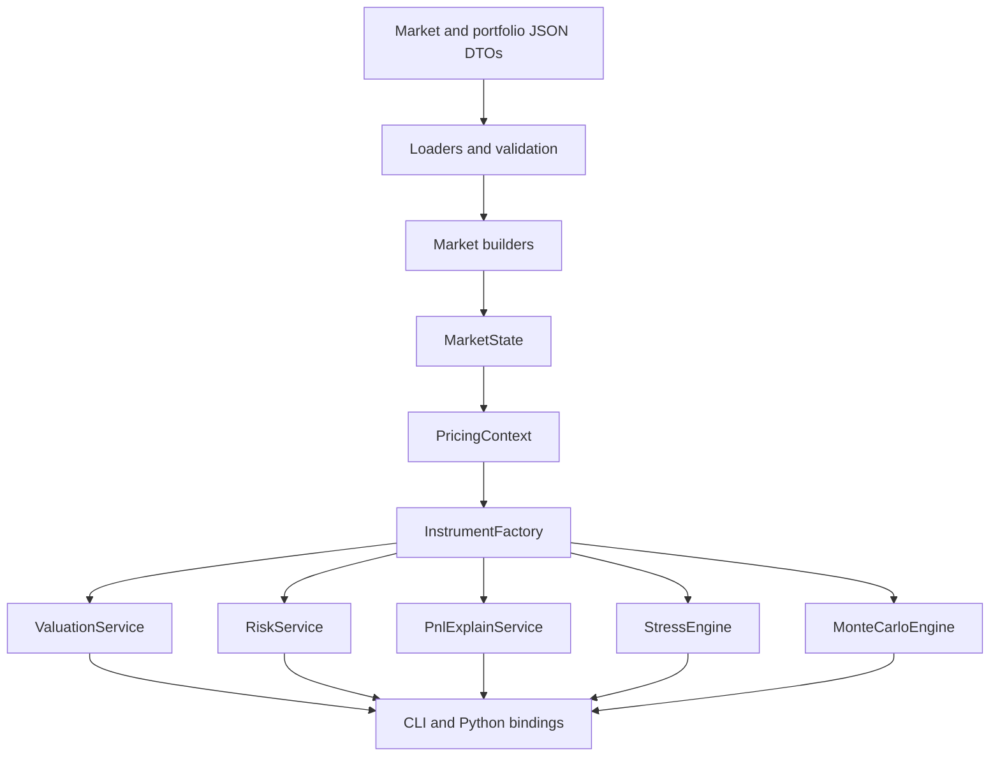
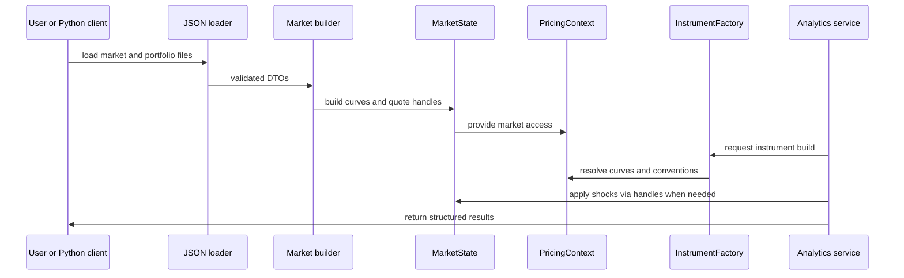
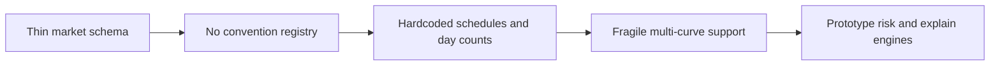

# Quant Risk Platform Architecture

This document is the **single design source of truth** for the platform architecture. It combines the previous
high-level and low-level notes and explains not only **what** the components are, but also **why** the design choices
were made.

## 1. Design goals

The target system is a production-shaped quantitative risk engine with the following properties:

- market-consistent valuation,
- reusable market objects and reactive quote handles,
- clear separation between market construction, instruments, and analytics,
- deterministic risk, historical stress, and Monte Carlo,
- scalable revaluation and future parallelization,
- application-level interfaces for CLI and Python.

## 2. High-level architecture

### Why this layering is used

- **DTOs** isolate external file formats from internal objects.
- **Loaders and validation** keep malformed payloads out of the engine.
- **Market builders** convert raw quotes and conventions into QuantLib term structures.
- **MarketState** owns reusable handles and curves.
- **PricingContext**: Resolves which curves and conventions an instrument should use.
- **BuiltPortfolio / BuiltTrade**: Cached representation of trades as QuantLib instruments, ready for pricing and risk.
- **InstrumentFactory**: Translates trades into QuantLib instruments.
- **Analytics services**: Operate on built market state and built instruments rather than re-parsing JSON.
- **Local Database (SQLite)**: Stores portfolios, trades, market data, and historical results (valuations, sensitivities, P&L, VaR).
- **CLI / Python**: Expose stable application services rather than raw QuantLib internals.

## 4. Portfolios and Identifiers

The platform uses stable, structured internal identifiers to ensure consistency across market state, risk reports, and
the database.

### 4.1 Portfolio Identifiers
Format: `PORT:<portfolio_group>:<book>:<portfolio_name>`
Examples:
- `PORT:DEMO:MACRO:GLOBAL_RATES`
- `PORT:DEMO:XASSET:MULTI_ASSET_01`

### 4.2 Trade Identifiers
Format: `TRD:<asset_class>:<book>:<sequence>`
Examples:
- `TRD:RATES:MACRO:000001`
- `TRD:CDS:CREDIT:000014`

### 4.3 Risk Factor Identifiers
Format: `RF:<family>:<currency_or_market>:<object>:<bucket>`
Examples:
- `RF:RATES:USD:OIS:2Y`
- `RF:FX:EURUSD:SPOT:ALL`

These identifiers are shared across market state, shock definitions, and risk reports to enable seamless reconciliation and attribution.

## 5. Core QuantLib design choices

### 3.1 Why use `SimpleQuote` handles

`SimpleQuote` is the right primitive for a revaluation engine because it supports in-place updates of market inputs.

**Tradeoffs:**

- **Pros:** Extremely fast for scenarios and risk (no curve rebuilds), reactive (uses Observer pattern).
- **Cons:** Shared state must be managed carefully in multi-threaded environments.

Why this matters in our project:

- a bump to a quote should not require rebuilding the entire engine,
- QuantLib's observer pattern automatically invalidates dependent objects,
- risk, stress, and Monte Carlo can reuse instruments and curves.

This is the correct foundation for PV01, key-rate risk, historical stress, and scenario engines.

### 3.2 Why use `RateHelper` objects for yield curves

A curve should be calibrated to market instruments, not merely interpolated through arbitrary rates.

**QuantLib Functions Used:**

- `DepositRateHelper`: For short-term cash rates.
- `OISRateHelper`: For Overnight Index Swaps (collateral discounting).
- `FraRateHelper`: For Forward Rate Agreements.
- `SwapRateHelper`: For vanilla interest rate swaps.

**Tradeoffs:**

- **Pros:** instrument-consistent bootstrapping, transparent calibration logic, industry alignment.
- **Cons:** requires solving a non-linear system (bootstrapping), more complex than simple spline interpolation.

### 3.3 Why use `PiecewiseYieldCurve<Discount, LogLinear>` initially

This is a good first production choice because:

- **QuantLib choice:** `LogLinear` interpolation on `Discount` factors.
- **Why:** This ensures discount factors stay positive and monotonically decreasing, which is a physical requirement.
- **Tradeoff:** `LogLinear` on discounts implies piecewise constant forward rates. This is very stable but results in
  "staircase" forward curves. Cubic splines provide smoother forwards but can introduce oscillations (overshoot).

## 6. Platform vs QuantLib Architecture

| Aspect      | QuantLib Approach                | Our Project Approach                | Why?                                         |
|-------------|----------------------------------|-------------------------------------|----------------------------------------------|
| **Data**    | Object-oriented, heavy objects   | DTO-based (JSON) + SQLite           | Persistence, interop, and auditability.      |
| **State**   | Distributed in objects           | Centralized in `MarketState`        | Easier to manage scenarios and snapshots.    |
| **Pricing** | `setPricingEngine` on instrument | `ValuationService` wrapper          | Separation of concerns; easier to audit.     |
| **Risk**    | Ad-hoc or via `RelinkableHandle` | Standardized `RiskService` + `RF:`  | Consistent reporting and performance tuning. |

## 7. Current runtime flow

## 5. Current code mapping

### Domain layer

Files:

- `cpp/include/qrp/domain/types.hpp`
- `cpp/include/qrp/domain/market_data.hpp`
- `cpp/include/qrp/domain/portfolio.hpp`

Current state:

- basic DTOs exist,
- typed curve identifiers exist,
- schema is still too thin for full convention-aware curve building.

### Market layer

Files:

- `cpp/include/qrp/market/market_state.hpp`
- `cpp/include/qrp/market/market_snapshot.hpp`
- `cpp/src/market/market_snapshot.cpp`
- `cpp/include/qrp/market/scenario_engine.hpp`
- `cpp/src/market/scenario_engine.cpp`

Current state:

- quote handles and bootstrapped yield curves exist,
- scenario application can mutate quote handles in place,
- credit curves, vol surfaces, and richer curve families are missing,
- conventions are still embedded in builder logic rather than registered centrally.

### Pricing context

File:

- `cpp/include/qrp/analytics/pricing_context.hpp`

Current state:

- basic curve lookup exists,
- curve-family mismatch bug appears fixed (`OIS` is used consistently now),
- still needs a proper `MarketConventionRegistry` to avoid hardcoded instrument assumptions.

### Instrument layer

Files:

- `cpp/include/qrp/instruments/instrument_factory.hpp`
- `cpp/src/instruments/instrument_factory.cpp`

Current state:

- vanilla swaps and fixed-rate bonds are implemented,
- calendars, schedules, and day-count conventions are mostly hardcoded,
- there is not yet a reusable built-position cache.

### Analytics layer

Files:

- `valuation_service.cpp`
- `risk_service.cpp`
- `pnl_explain_service.cpp`
- `stress_engine.cpp`
- `monte_carlo_engine.cpp`

Current state:

- valuation works for the current sample instruments,
- risk is still brute-force bump-and-revalue,
- P&L explain is still placeholder-level,
- Monte Carlo is currently a one-step Gaussian scenario engine rather than a true path engine,
- historical stress is still scenario replay over generic shocked quotes.

## 6. Main design gaps to close next

The main gaps are:

1. **Market conventions are not centralized.**
2. **Curve families are not yet modeled beyond simple yield curves.**
3. **Instrument construction is not driven by conventions.**
4. **The analytics services do not yet share a built-position cache.**
5. **P&L explain, stress, and Monte Carlo need more realistic models.**

## 7. Target architecture evolution

### Phase 1: solid deterministic rates engine

- central `MarketConventionRegistry`,
- richer market schema,
- OIS discount + projection curves,
- reusable built-position cache,
- deterministic PV01 / key-rate / scenario engines,
- production-shaped P&L explain.

### Phase 2: credit and volatility market objects

- hazard / survival curves,
- credit spread factors,
- vol surfaces and smile inputs,
- richer factor mapping and risk attribution.

### Phase 3: scalable simulation architecture

- Monte Carlo path engine,
- historical scenario store,
- cached factor mappings,
- parallel scenario execution.

## 8. Why the current design is still the right base

Even though the implementation is incomplete, the chosen direction is good because:

- QuantLib handles are the right primitive for fast revaluation,
- rate helpers are the right primitive for market-consistent curve construction,
- layering is already service-oriented rather than notebook-oriented,
- the current gaps are mainly missing abstractions and incomplete analytics, not a fundamentally wrong architecture.

## 9. Documentation policy going forward

To keep the design coherent:

- maintain **one canonical architecture document**: `docs/design/ARCHITECTURE.md`,
- use specialized supporting notes only when they add real value,
- every design note must explain both:
    - the chosen design,
    - why that design is preferred over simpler alternatives,
- every important QuantLib choice should be justified in terms of correctness, performance, and extensibility,
- whenever a milestone changes the implementation shape, refresh the corresponding files under `docs/design/` and
  `docs/roadmap/` in the same pass,
- do not allow code, docs, and sample JSON schemas to drift apart.
