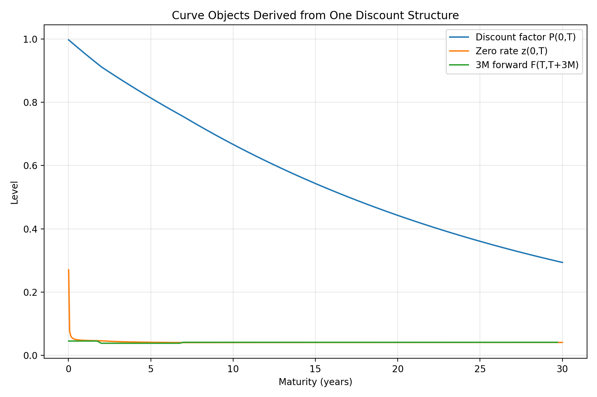
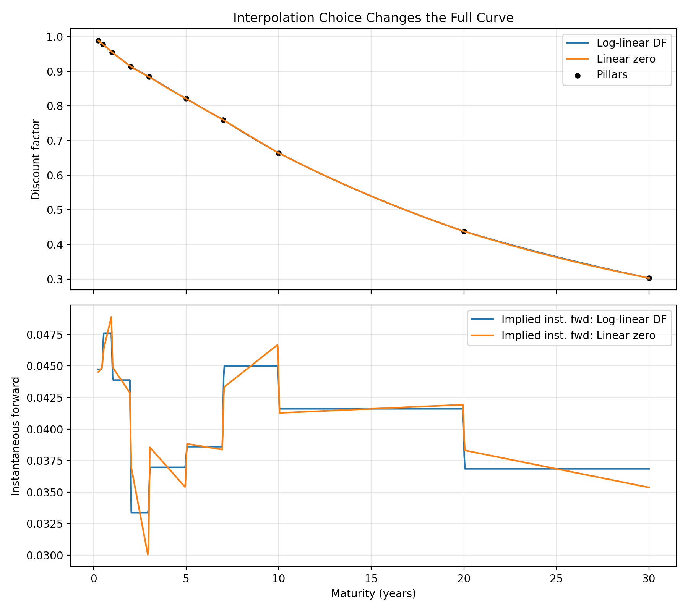

# Detailed Yield-Curve Implementation in Practice (USD / EUR / CHF)

## Notation used in this chapter

Unless stated otherwise:

- $0$ is the valuation date.
- $T$, $T_1$, and $T_2$ are maturities in years from today.
- $P(0,T)$ is the discount factor to maturity $T$.
- $z(0,T)$ or $r(0,T)$ is a zero rate to maturity $T$.
- $z_m(0,T)$ is a zero rate quoted with compounding frequency $m$.
- $F(0;T_1,T_2)$ is the simple forward rate between $T_1$ and $T_2$.
- $f(0,T)$ is the instantaneous forward rate.
- $\tau(T_1,T_2)$ is the accrual year fraction between $T_1$ and $T_2$.
- $m$ is the compounding frequency per year.
- $ccy$ is the currency code.
- $f(x)=0$ denotes a nonlinear equation to be solved in calibration or bootstrapping.
- $x_n$ is the current Newton-Raphson iterate where root-finding is explicitly discussed.

## 1. What this chapter is for

This chapter is the **production-grade extension** of the earlier yield-curve notes.

The goal is to make the implementation choices and operational trade-offs explicit:

- what the curve object is in code,
- how a desk curve is built in practice,
- what raw quotes are needed,
- what instrument sets are typical in USD, EUR, and CHF,
- how `discount`, `zeroRate`, and `forwardRate` are related,
- what `discountImpl` means in a term-structure implementation,
- how interpolation and extrapolation choices affect pricing and risk,
- which trade-offs are typically preferred in a front-office platform.

The most important implementation principle is:

> The canonical state variable of a rates curve should usually be the **discount factor term structure**; zero rates and
> forwards should be derived consistently from it.

---

## 2. What a production curve stack looks like

For a modern front-office rates platform, do not think of "the yield curve" as a single thing.

A modern setup usually needs a **curve set**.

For one currency the stack may include:

- an overnight / OIS discount curve,
- one or more projection curves for term indices,
- possibly an inflation curve,
- possibly basis curves,
- possibly sovereign bond curves for reporting or macro views,
- possibly cross-currency basis-adjusted curves for FX-linked products.

In simplified notation:

$$
\text{CurveSet}_{ccy}
=
\{
\text{OIS discount},
\text{3M forward},
\text{6M forward},
\text{inflation},
\text{basis},
\text{sovereign benchmark}
\}
$$

For this platform, the most important object is the **OIS discount curve**, together with its relationship to forward
curves and sovereign curves.

---

## 3. Discount factor, zero rate, and forward rate: the canonical relationship

### 3.1 Discount factor

The primitive object is:

$$
P(0,T)
$$

Where:

- $P(0,T)$ is the discount factor from today to maturity $T$.
- $T$ is a maturity or future time, typically measured in years from today.
- $0$ denotes the valuation date, or “today,” when it appears in term-structure notation.

which means the value today of receiving 1 unit of currency at time $T$.

### 3.2 Zero rate

Given a discount factor, a continuously compounded zero rate is:

$$
z(0,T) = -\frac{\ln P(0,T)}{T}
$$

Where:

- $P(0,T)$ is the discount factor from today to maturity $T$.
- $T$ is a maturity or future time, typically measured in years from today.
- $0$ denotes the valuation date, or “today,” when it appears in term-structure notation.

More generally, with compounding convention $m$:

$$
P(0,T) = \left(1+\frac{z_m(0,T)}{m}\right)^{-mT}
$$

Where:

- $m$ is the compounding frequency per year.

### 3.3 Forward rate

A simple forward rate between $T_1$ and $T_2$ is:

$$
F(0;T_1,T_2)
=
\frac{1}{\tau(T_1,T_2)}
\left(
\frac{P(0,T_1)}{P(0,T_2)} - 1
\right)
$$

where $T_1$ and $T_2$ bound the accrual period and $\tau(T_1,T_2)$ is the year fraction between them.

The instantaneous forward rate is:

$$
f(0,T) = -\frac{\partial \ln P(0,T)}{\partial T}
$$

Where:

- $P(0,T)$ is the discount factor from today to maturity $T$.
- $f(0,T)$ is the instantaneous forward rate at maturity $T$.
- $T$ is a maturity or future time, typically measured in years from today.
- $0$ denotes the valuation date, or “today,” when it appears in term-structure notation.

- **discount factors** are used for PV,
- **zero rates** are useful for reporting and macro interpretation,
- **forward rates** are useful for floating-cash-flow projection and for understanding what the curve implies about
  future short rates.

A good line to say out loud is:

> In code, the discount function should be stored or interpolated directly and zero-rate or forward-rate views should be
> derived consistently, because that keeps pricing and risk internally coherent.

---

## 3B. Micro-example: discount factor conventions and when root-finding is needed

For a 1Y cash flow of 100 discounted at 4%:

Annual compounding:

$$
PV = \frac{100}{1.04}=96.1538
$$

Where:

- $PV$ is the present value of the cash flow or instrument.

Continuous compounding:

$$
PV = 100 e^{-0.04}=96.0789
$$

Where:

- $0$ denotes the valuation date, or “today,” when it appears in term-structure notation.

So a production system must store or infer:

- compounding convention,
- day-count convention,
- accrual factor,
- calendar / business-day adjustments.

The convergence from discrete compounding

$$
P_m(0,T)=\frac{1}{\left(1+\frac{r}{m}\right)^{mT}}
$$

Where:

- $P_m(0,T)$ is the discount factor to maturity $T$ under compounding frequency $m$.
- $m$ is the compounding frequency per year.
- $T$ is a maturity or future time, typically measured in years from today.

to continuous compounding

$$
e^{-rT}
$$

comes from the exponential limit

$$
\left(1+\frac{x}{m}\right)^m \to e^x
$$

from Euler's exponential limit and the definition of Euler's number $e$.

When bootstrapping or calibrating a curve, some instruments lead to a non-linear residual equation for the unknown node
or parameter.

A common setup is

$$
f(x)=PV_{\text{model}}(x)-PV_{\text{market}}=0
$$

Where:

- $x$ is the unknown node or parameter.
- $PV_{\text{model}}(x)$ is the model price as a function of that unknown.
- $PV_{\text{market}}$ is the observed market price or quote converted into price terms.

Newton-Raphson updates the current guess by

$$
x_{n+1}=x_n-\frac{f(x_n)}{f'(x_n)}
$$

Where:

- $n$ is the iteration index.
- $x_n$ is the current guess.
- $x_{n+1}$ is the next guess.
- $f'(x_n)$ is the derivative of the residual with respect to the unknown.

For example, some simple swap nodes can be solved directly, but CDS hazard nodes, implied vols, and more complex curve
instruments are often solved numerically.

#### Example for 3.1 — Newton-Raphson for an implied yield

Suppose a 2Y annual-coupon bond with face value 100 and annual coupon 4 trades at 100.50. The implied annual yield $y$
solves

$$
\frac{4}{1+y}+\frac{104}{(1+y)^2}=100.50
$$

Define

$$
f(y)=\frac{4}{1+y}+\frac{104}{(1+y)^2}-100.50
$$

Then

$$
f'(y)=-\frac{4}{(1+y)^2}-\frac{208}{(1+y)^3}
$$

Starting from $y_0=0.03$:

$$
f(0.03)\approx 1.41347, \qquad f'(0.03)\approx -194.11985
$$

so

$$
y_1\approx 0.0372814
$$

A second update gives

$$
y_2\approx 0.0373590
$$

and the solution is about

$$
y\approx 3.7359\%
$$

This is the same numerical pattern used in more complex calibration problems: define a residual, compute its derivative,
and iterate to the root.

## 4. What `discount`, `zeroRate`, `forwardRate`, and `discountImpl` mean in practice

In a QuantLib-style architecture, the public term-structure API usually looks like:

- `discount(date_or_time)`
- `zeroRate(date_or_time, dayCounter, compounding, frequency)`
- `forwardRate(date1, date2, dayCounter, compounding, frequency)`

Under the hood, the key primitive is often:

- `discountImpl(Time t)`

### 4.1 Public vs. internal API

The **public** `discount(...)` method should handle:

- date-to-time conversion,
- day-count conventions,
- range checks,
- jump adjustments,
- extrapolation policy,
- caching if needed.

Then it delegates to the internal primitive:

$$
\texttt{discountImpl}(t)
$$

Where:

- $t$ is a time variable, or the real argument of a moment generating function depending on context.

which returns the discount factor at time $t$.

So conceptually:

$$
\texttt{discount(Date)}
\rightarrow
t
\rightarrow
\texttt{discountImpl}(t)
\rightarrow
P(0,t)
$$

Where:

- $0$ denotes the valuation date, or “today,” when it appears in term-structure notation.

### 4.2 Why `discountImpl` is the right primitive

When only `discountImpl` is implemented, the remaining views can be derived:

- zero rates from discount factors,
- forwards from discount-factor ratios,
- carry and roll-down from the same curve,
- risk from bumps to the same nodes.

That is elegant and robust.

### 4.3 Skeleton implementation

```cpp
class YieldCurveBase {
public:
    DiscountFactor discount(const Date& d) const {
        Time t = dayCounter_.yearFraction(referenceDate_, d);
        checkRange(t, extrapolate_);
        return applyJumpsIfAny(t, discountImpl(t));
    }

    Rate zeroRate(Time t, Compounding comp, Frequency freq) const {
        DiscountFactor df = discount(t);
        if (comp == Continuous) {
            return -std::log(df) / t;
        }
        return compoundingFromDiscount(df, t, comp, freq);
    }

    Rate forwardRate(Time t1, Time t2, DayCounter dc,
                     Compounding comp, Frequency freq) const {
        DiscountFactor df1 = discount(t1);
        DiscountFactor df2 = discount(t2);
        Time tau = dayCountFraction(dc, t1, t2);
        return forwardFromDiscounts(df1, df2, tau, comp, freq);
    }

protected:
    virtual DiscountFactor discountImpl(Time t) const = 0;
};
```

### 4.4 Example of a piecewise log-linear implementation

```cpp
DiscountFactor PiecewiseDiscountCurve::discountImpl(Time t) const {
    auto seg = locateSegment(t); // find pillar interval [t_i, t_{i+1}]
    const auto& [i, w] = seg;    // w in [0,1]
    double log_df =
        (1.0 - w) * std::log(discounts_[i]) +
         w        * std::log(discounts_[i + 1]);
    return std::exp(log_df);
}
```

This is exactly why **log-linear interpolation on discount factors** is such a natural production default.

### 4.5 Implied discount factors from a shifted reference date

Some applications also require an **implied term structure** starting from a future date $s$.

Then the implied discount factor from $s$ to $T$ is:

$$
P(s,T) = \frac{P(0,T)}{P(0,s)}
$$

Where:

- $P(0,T)$ is the discount factor from today to maturity $T$.
- $T$ is a maturity or future time, typically measured in years from today.
- $0$ denotes the valuation date, or “today,” when it appears in term-structure notation.

This matters for:

- forward-starting trades,
- carry / roll-down analytics,
- scenario comparison at a shifted anchor date,
- future exposure engines.

---

## 4A. Forward discount factors and shifted curves in practice

A very common production calculation is the discount factor **between two future dates**:

$$
P(T_1,T_2)=\frac{P(0,T_2)}{P(0,T_1)}
$$

Where:

- $P(0,T_1)$ is the discount factor from today to time $T_1$.
- $P(0,T_2)$ is the discount factor from today to time $T_2$.
- $T_1$ is the start date of a forward or accrual period, measured from today.
- $T_2$ is the end date of a forward or accrual period, measured from today.
- $0$ denotes the valuation date, or “today,” when it appears in term-structure notation.

#### Example for 4.5 — shifted implied curve using ImpliedTermStructure

Suppose the curve gives:

$$
P(0,2)=0.928173, \qquad P(0,5)=0.792000
$$

Then:

$$
P(2,5)=\frac{0.792000}{0.928173}=0.853290
$$

The corresponding continuously compounded forward zero over the 3-year interval is:

$$
z(2,5)=-\frac{\ln(0.853290)}{3}\approx 5.286\%
$$

The simple forward rate is:

$$
F(2,5)=\frac{1}{3}\left(\frac{1}{0.853290}-1\right)\approx 5.731\%
$$

### QuantLib mapping

Given an existing `YieldTermStructure`, the raw forward discount factor is usually obtained by direct ratio:

```cpp
DiscountFactor df_0_2 = curve->discount(date2Y);
DiscountFactor df_0_5 = curve->discount(date5Y);
DiscountFactor df_2_5 = df_0_5 / df_0_2;
```

For the implied forward **rate**, call:

```cpp
Rate fwd = curve->forwardRate(date2Y, date5Y,
                              Actual365Fixed(), Continuous).rate();
```

For a genuine **shifted curve object** whose new reference date is `date2Y`, use an implied term structure:

```cpp
Handle<YieldTermStructure> base(curve);
ext::shared_ptr<YieldTermStructure> implied =
    ext::make_shared<ImpliedTermStructure>(base, date2Y);
DiscountFactor df_2_5_again = implied->discount(date5Y);
```

This distinction is useful in practice:

- direct ratio for light-weight PV and explain logic,
- `forwardRate(...)` for desk-facing rate reporting,
- `ImpliedTermStructure` for forward-starting trade valuation, carry, exposure, and shifted-horizon scenario analysis.

## 5. Internal identifiers vs. vendor tickers

One of the most important production design choices is:

> Never hard-code vendor tickers directly into pricing logic.

Instead:

- use **normalized internal IDs** inside the analytics stack,
- map them to vendor-specific tickers in the market-data acquisition layer,
- version the mappings.

For example:

| Internal ID   | Meaning                        |
|---------------|--------------------------------|
| `USD-RFR-ON`  | USD overnight risk-free fixing |
| `USD-OIS-1W`  | 1-week USD OIS quote           |
| `USD-OIS-5Y`  | 5-year USD OIS par swap        |
| `EUR-RFR-ON`  | EUR overnight risk-free fixing |
| `CHF-RFR-ON`  | CHF overnight risk-free fixing |
| `CHF-OIS-10Y` | 10-year CHF OIS par swap       |

Then the market-data layer maps them to vendor feeds.

### 5.1 Public examples for overnight-fixing identifiers

Representative publicly documented examples are:

- USD SOFR overnight rate: `SOFRRATE Index`
- EUR €STR overnight rate: `ESTRON Index`
- CHF SARON reference: public documentation often cites Bloomberg / Refinitiv identifiers such as `SSARON` / `SARON.S`,
  and SIX also publishes fixings `SRFXON1`, `SRFXON2`, `SRFXON3`

For listed front-end futures, use the **exchange root plus contract month/year**, then map to the vendor mnemonic in
the feed layer.

Examples of public exchange roots:

- CME SOFR futures: `SR3`
- Eurex 3M SARON futures: `FSO3`
- ICE 3M SARON futures: `SA3`

### 5.2 Practical takeaway

> Normalized instrument IDs such as `USD-OIS-5Y` should be stored in the platform, while Bloomberg or exchange symbols
> should stay in the market-data adapter because vendor symbology is not stable enough to hard-code in pricing code.

This separation is the standard production pattern.

---

## 6. Curve families by currency

## 6.1 USD

### Discount curve

The standard collateralized discount curve is the **SOFR OIS curve**.

Typical raw inputs:

- overnight fixing / RFR history: `SOFRRATE Index`
- very short end: overnight, tomorrow-next, 1W, 2W, 1M, 2M, 3M OIS or cash-style inputs depending on data source
- front-end liquid contracts: SOFR futures (`SR3`) or short OIS
- medium / long end: SOFR OIS swaps from 1Y out to 30Y / 50Y

Typical internal IDs:

- `USD-RFR-ON`
- `USD-OIS-1W`
- `USD-OIS-1M`
- `USD-OIS-3M`
- `USD-SR3-H6`
- `USD-SR3-M6`
- `USD-OIS-1Y`
- `USD-OIS-2Y`
- `USD-OIS-3Y`
- ...
- `USD-OIS-30Y`

### Projection curves

If the book contains term-floaters or legacy structures:

- `USD-TERM-1M`
- `USD-TERM-3M`
- `USD-TERM-6M`

These are forecast curves, not discount curves.

### Sovereign benchmark

For macro views:

- Treasury bills, notes, and bonds form a sovereign benchmark curve.
- This is **not** identical to OIS.

---

## 6.2 EUR

### Discount curve

The standard collateralized discount curve is the **€STR OIS curve**.

Typical raw inputs:

- overnight fixing: `ESTRON Index`
- short OIS or depo/OIS hybrid quotes depending on source
- €STR OIS swaps along standard maturities
- optional listed front-end futures when the chosen market convention set uses them

Typical internal IDs:

- `EUR-RFR-ON`
- `EUR-OIS-1W`
- `EUR-OIS-1M`
- `EUR-OIS-3M`
- `EUR-OIS-6M`
- `EUR-OIS-1Y`
- `EUR-OIS-2Y`
- ...
- `EUR-OIS-30Y`

### Projection curves

If needed for Euribor-linked products:

- `EUR-EURIBOR-3M`
- `EUR-EURIBOR-6M`

### Sovereign benchmark

For macro or credit-spread analysis, people often track sovereign curves such as:

- Germany (Schatz / Bobl / Bund) as a quasi-core benchmark,
- plus BTP / OAT / Bonos spreads for relative value and risk-off / risk-on interpretation.

Again, that is separate from the discounting OIS curve.

---

## 6.3 CHF

### Discount curve

The standard collateralized discount curve is the **SARON OIS curve**.

Typical raw inputs:

- SARON overnight reference / fixings: public sources cite `SSARON` / `SARON.S`, plus SIX fixings `SRFXON1`, `SRFXON2`,
  `SRFXON3`
- short SARON OIS / money-market style inputs
- SARON futures such as Eurex `FSO3` or ICE `SA3` if used by the desk
- SARON OIS swaps out the curve

Typical internal IDs:

- `CHF-RFR-ON`
- `CHF-OIS-1W`
- `CHF-OIS-1M`
- `CHF-OIS-3M`
- `CHF-FSO3-U6`
- `CHF-OIS-1Y`
- `CHF-OIS-2Y`
- ...
- `CHF-OIS-30Y`

### Sovereign benchmark

For macro interpretation:

- Swiss Confederation bonds provide the sovereign benchmark term structure.

This can diverge from SARON OIS because:

- sovereign cash bonds embed supply/demand and repo effects,
- SARON is rooted in the secured overnight funding market.

---

## 7. How to build an OIS discount curve concretely

The right answer is not “fit some line through yields.”

The right answer is:

> A piecewise discount curve should be bootstrapped from tradable instruments using instrument-specific pricing
> equations and market conventions.

### 7.1 Step 1: define conventions explicitly

For each currency, specify:

- calendar,
- spot lag,
- payment lag,
- fixed leg frequency,
- fixed leg day count,
- floating overnight index,
- business-day conventions,
- end-of-month rule,
- pillar rule,
- interpolation,
- extrapolation.

For example, for a USD SOFR OIS discount curve, an implementation object might look like:

```json
{
  "curve_id": "USD-OIS-DISC",
  "currency": "USD",
  "reference_rate": "SOFR",
  "calendar": "UnitedStates(SOFR)",
  "spot_lag_bd": 2,
  "fixed_leg_day_count": "Act/360",
  "fixed_leg_frequency": "Annual",
  "fixed_leg_convention": "ModifiedFollowing",
  "interpolation": "LogLinearDiscount",
  "extrapolation": "FlatForwardAfterLLP"
}
```

### 7.2 Step 2: load normalized market quotes

Example quote set:

```json
[
  {"id":"USD-RFR-ON", "value":0.0532},
  {"id":"USD-OIS-1W", "value":0.0530},
  {"id":"USD-OIS-1M", "value":0.0526},
  {"id":"USD-OIS-3M", "value":0.0519},
  {"id":"USD-SR3-H6", "price":95.10},
  {"id":"USD-SR3-M6", "price":95.22},
  {"id":"USD-OIS-1Y", "value":0.0495},
  {"id":"USD-OIS-2Y", "value":0.0458},
  {"id":"USD-OIS-3Y", "value":0.0432},
  {"id":"USD-OIS-5Y", "value":0.0410},
  {"id":"USD-OIS-10Y","value":0.0405},
  {"id":"USD-OIS-30Y","value":0.0398}
]
```

### 7.3 Step 3: choose helper instruments by maturity bucket

A practical maturity split is:

- overnight to ~3M: overnight fixings, short OIS, or cash-style instruments if consistent with desk convention,
- ~3M to ~2Y: futures and/or short swaps,
- longer maturities: standard OIS swaps.

### 7.4 Step 4: bootstrap sequentially

At the very short end, if a quote behaves like a simple money-market rate:

$$
P(0,T) \approx \frac{1}{1+r \tau}
$$

Where:

- $P(0,T)$ is the discount factor from today to maturity $T$.
- $T$ is a maturity or future time, typically measured in years from today.
- $0$ denotes the valuation date, or “today,” when it appears in term-structure notation.

For a **par OIS swap** with fixed rate $K$ and payment dates $t_1,\dots,t_n$, the fixed rate is chosen so that the swap
has zero present value at trade date:

$$
K \sum_{i=1}^{n} \alpha_i P(0,t_i) = 1 - P(0,t_n)
$$

Where:

- $n$ is the number of fixed-leg payment dates in the swap.
- $\alpha_i$ is the accrual year fraction for coupon period $i$.
- $t_i$ is the payment date of coupon period $i$.

When the earlier discount factors are already known, the last one is obtained from:

$$
P(0,t_n)
=
\frac{1 - K\sum_{i=1}^{n-1}\alpha_i P(0,t_i)}
{1 + K\alpha_n}
$$

That is the sequential bootstrap logic.

#### Example for 7.4 — solving the next OIS discount factor

Suppose a 3Y annual-pay par OIS swap has fixed rate

$$
K=4.32\%
$$

and earlier discount factors are already known:

$$
P(0,1Y)=0.952835, \qquad P(0,2Y)=0.914714
$$

Then the 3Y discount factor is solved from

$$
0.0432\bigl(P(0,1Y)+P(0,2Y)+P(0,3Y)\bigr)=1-P(0,3Y)
$$

which gives

$$
P(0,3Y)=
\frac{1-0.0432(0.952835+0.914714)}{1+0.0432}=0.882412
$$

This is the concrete meaning of “bootstrap sequentially.”

### 7.5 Step 5: interpolate between pillars

Once discount factors are solved at pillar dates, define `discountImpl(t)` between nodes using the chosen interpolation
method.

#### Example for 7.5 — interpolation inside `discountImpl(t)`

Suppose the curve has pillar discount factors

$$
P(0,2Y)=0.914714, \qquad P(0,3Y)=0.882412
$$

With log-linear interpolation, a query at 2.5Y evaluates as

$$
P(0,2.5Y) \approx \exp\left(0.5\ln 0.914714 + 0.5\ln 0.882412\right)=0.898418
$$

So `discountImpl(2.5)` returns an interpolated discount factor between the two solved nodes.

### 7.6 Step 6: validate

The validation checklist is:

- each calibration instrument reprices to within tolerance,
- the curve is arbitrage-consistent enough for the chosen use case,
- forward behavior is not pathological,
- sensitivities are stable under small quote perturbations,
- pillar date logic is reproducible across runs.

#### Example for 7.6 — what a validation failure looks like

Suppose the market quote for a 5Y OIS swap is 4.10%, but after building the curve the helper reprice implies 4.16%.
That 6 bp residual is too large for a production curve and usually signals a problem such as:

- wrong day count,
- wrong payment calendar,
- stale quote, or
- a helper built with the wrong instrument convention.

A good platform surfaces that residual immediately instead of silently publishing the curve.

### 7.7 Step 7: persist and version

Store:

- as-of timestamp,
- source venue(s),
- normalized IDs,
- raw quotes,
- conventions package,
- pillar dates,
- fitted discount factors,
- interpolation/extrapolation policy,
- validation residuals.

That is what makes the curve auditable.

---

## 8. How GDP, inflation, and central-bank views translate to curve moves

This question comes up repeatedly in implementation reviews.

Use this chain:

$$
\text{macro data}
\rightarrow
\text{policy expectation}
\rightarrow
\text{front-end repricing}
\rightarrow
\text{whole-curve repricing}
$$

For example:

- higher CPI than expected
- stronger payrolls
- sticky wage growth

can imply:

- fewer cuts priced,
- front-end yields up,
- OIS discount factors down at short maturities.

If recession risk rises:

- expected policy path shifts down,
- front-end OIS yields fall,
- sovereign long end may rally,
- credit spreads may widen.

That is why the platform must support:

- live curve updates,
- key-rate DV01,
- scenario shocks,
- P&L explain split by discount vs. spread vs. vol.

---

## 9. The best interpolation choices and their trade-offs

There is no universally best interpolation.
There is only the best choice **for a given desk objective**.

## 9.1 Log-linear on discount factors

This is the production default that is easiest to defend first.

Definition between $t_i$ and $t_{i+1}$:

$$
\ln P(0,t)
=
(1-w)\ln P(0,t_i) + w \ln P(0,t_{i+1})
$$

Where:

- $t$ is a time variable, or the real argument of a moment generating function depending on context.
- $0$ denotes the valuation date, or “today,” when it appears in term-structure notation.

with

$$
w = \frac{t-t_i}{t_{i+1}-t_i}
$$

### Advantages

- discount factors stay positive,
- simple and robust,
- easy to explain and audit,
- stable for pricing and risk,
- implies piecewise-constant instantaneous forwards on each interval,
- commonly used in production.

### Drawbacks

- forward curve can look too blocky,
- less visually smooth than spline methods.

### Best use

- OIS discount curves,
- general front-office risk engines,
- high-throughput bump-and-revalue systems.

---

## 9.2 Linear interpolation on zero rates

Definition:

$$
z(t) = (1-w)z(t_i) + w z(t_{i+1})
$$

Where:

- $t$ is a time variable, or the real argument of a moment generating function depending on context.

then

$$
P(0,t)=e^{-z(t)t}
$$

Where:

- $0$ denotes the valuation date, or “today,” when it appears in term-structure notation.

for continuous compounding.

### Advantages

- intuitive,
- smoother than pure piecewise forwards,
- simple to explain to non-quant users.

### Drawbacks

- can create less natural discount behavior than log-linear DF,
- forward curve can still have kinks,
- risk can depend subtly on compounding conventions.

### Best use

- reporting curves,
- macro interpretation,
- some legacy frameworks.

---

## 9.3 Linear interpolation on instantaneous forwards

You interpolate $f(0,t)$ directly.

### Advantages

- can create smoother zero curves,
- useful when the economic view is naturally forward-based.

### Drawbacks

- more sensitive to noise,
- easier to create unrealistic oscillations if not constrained,
- less robust as a default production choice.

### Best use

- specialized rate-model or research contexts,
- not the first choice for the main desk discount curve.

---

## 9.4 Cubic spline / log-cubic / monotone-convex methods

These try to make the curve smoother.

### Advantages

- visually appealing,
- smoother first derivatives,
- can be better for option-model inputs or smooth scenario generation.

### Drawbacks

- easy to overfit noisy quotes,
- can create local artifacts,
- risk becomes less transparent,
- more difficult to defend if P&L explain must be audit-friendly.

### Best use

- secondary reporting curves,
- research surfaces,
- model-building contexts where smoothness matters.

> Splines are attractive visually, but for a desk discount curve robustness, monotonicity, and explainability usually
> matter more than cosmetic smoothness.

---

## 9.5 Parametric fits: Nelson–Siegel / Svensson

These are not sequential bootstrap curves from exact tradables; they are low-dimensional fits.

### Advantages

- compact parameterization,
- useful for macro analysis and factor interpretation,
- convenient for scenario design and historical modeling.

### Drawbacks

- not exact instrument repricing,
- fit quality depends on objective and constraints,
- less appropriate as the primary pricing curve.

### Best use

- historical factor models,
- scenario engines,
- macro and risk reporting,
- not as the sole front-office discounting curve.

---

## 10. What extrapolation policy is best

Again, no universal answer.

The appropriate policy depends on the use case:

- pricing within liquid maturities,
- running stress tests,
- projecting long-dated insurance liabilities,
- generating XVA tails,
- or simply reporting.

## 10.1 Do not extrapolate by default for trading prices

The safest front-office rule is:

> Disable extrapolation for live pricing unless the maturity is inside an approved liquid range or inside a clearly
> governed long-end policy.

That prevents accidental pricing using nonsense tails.

## 10.2 Flat forward after the last liquid point

A common pragmatic policy after the last liquid point (LLP) is:

- keep the instantaneous forward rate flat,
- equivalent to log-linear extrapolation of discount factors beyond the last pillar.

If the last forward is $f^*$, then for $T > T_{\text{LLP}}$:

$$
P(0,T)
=
P(0,T_{\text{LLP}})
e^{-f^*(T-T_{\text{LLP}})}
$$

Where:

- $P(0,T)$ is the discount factor from today to maturity $T$.
- $T$ is a maturity or future time, typically measured in years from today.
- $0$ denotes the valuation date, or “today,” when it appears in term-structure notation.

### Advantages

- simple,
- conservative,
- consistent with the last observed local slope.

### Drawbacks

- long-end valuation can become too sensitive to the last liquid node,
- may not reflect plausible long-run reversion.

## 10.3 Flat zero-rate extrapolation

Another option is to hold the zero rate constant beyond LLP:

$$
P(0,T)=e^{-z^* T}
$$

Where:

- $P(0,T)$ is the discount factor from today to maturity $T$.
- $T$ is a maturity or future time, typically measured in years from today.
- $0$ denotes the valuation date, or “today,” when it appears in term-structure notation.

with $z^*=z(0,T_{\text{LLP}})$.

### Advantages

- very simple.

### Drawbacks

- can imply odd forward behavior beyond LLP,
- usually less attractive than flat forward.

## 10.4 Parametric tail or UFR-style tail

For some applications:

- use a parametric tail,
- or converge to an ultimate forward rate.

### Advantages

- more economically shaped long end,
- less dependence on the last liquid node.

### Drawbacks

- needs strong governance,
- often overkill for front-office macro books.

### Recommended default

For a trading/risk platform:

- **inside the liquid range**: piecewise bootstrap with log-linear discounts,
- **outside the liquid range**: either no pricing, or flat-forward extrapolation under explicit governance.

This is a robust default policy for trading and risk systems.

---

## 11. Default production setup

One concrete recommendation for a macro, rates, or credit front-office platform is:

### For OIS discount curves

- bootstrap from tradable overnight / short-end / futures / OIS inputs,
- canonical representation: discount factors,
- interpolation: **log-linear on discount factors**,
- extrapolation: disabled by default, with explicit flat-forward tail only if governance requires it.

### For forward curves

- use tenor-specific curves if products need them,
- still favor robust node-based bootstraps over clever-but-fragile smoothing.

### For sovereign reporting curves

- keep them separate from OIS,
- use bond-specific calibration logic,
- never confuse sovereign yields with discounting curves.

This implementation pattern aligns with standard quant-platform practice.

---

## 12. Concrete `CurveBuilder` design

A clean design for a C++ / Python platform is:

```cpp
struct CurveSpec {
    std::string curve_id;
    std::string currency;
    std::string family;        // OIS_DISCOUNT, TERM_3M, SOVEREIGN, CREDIT_SPREAD
    std::string reference_rate;
    CalendarSpec calendar;
    DayCountSpec day_count;
    InterpSpec interpolation;
    ExtrapolationSpec extrapolation;
    std::vector<std::string> quote_ids;
};

struct BuiltCurve {
    CurveSpec spec;
    Date asof;
    std::vector<Date> pillar_dates;
    std::vector<double> pillar_dfs;
    ValidationReport validation;
    Handle<YieldTermStructure> ql_curve;
};
```

Then:

```cpp
BuiltCurve CurveBuilder::build(const CurveSpec& spec,
                               const MarketSnapshot& snap,
                               const ConventionRegistry& convs);
```

Inside `build(...)`:

1. resolve conventions,
2. fetch normalized quotes,
3. instantiate rate helpers,
4. create piecewise curve,
5. force bootstrap,
6. validate repricing residuals,
7. persist metadata and residuals.

That aligns well with the current project architecture.

---

## 13. Common implementation questions

### Why OIS for discounting?

Because collateralized pricing conventionally discounts at the collateral remuneration curve, and overnight RFR-based
OIS is the market standard proxy.

### Why not interpolate directly on yields?

Because discount-factor interpolation is usually more stable and auditable for pricing; yield interpolation can hide
undesirable forward behavior.

### Why not use Nelson–Siegel for live pricing?

Because it is a factor fit, not an exact tradable-instrument bootstrap, so it is better for scenario design and macro
analysis than for primary front-office pricing.

### Why separate OIS and sovereign curves?

Because OIS reflects the collateralized funding term structure, while sovereign curves embed bond-market-specific
liquidity, supply/demand, and repo effects.

### Recommended database content

Raw quotes, normalized IDs, as-of time, conventions package, pillar dates, pillar discount factors, interpolation
policy, extrapolation policy, repricing errors, and source provenance.

---

## 14. Compact summary

> In practice, USD, EUR, and CHF OIS discount curves should be built from normalized overnight and swap-market inputs,
> with vendor symbols mapped in the data layer rather than hard-coded in pricing code, and with the curve represented
> canonically through discount factors. In implementation terms, `discountImpl(t)` is the key primitive; `zeroRate` and
> `forwardRate` are derived views. For production, piecewise bootstrap with log-linear interpolation on discount factors
> is usually the preferred starting point because it is robust, positive, audit-friendly, and stable for P&L and risk,
> while strict extrapolation governance is applied beyond the last liquid point.

## 15. QuantLib function map: what gets called for which concept

### 15.1 Core term-structure queries

| Concept                           | Typical QuantLib call                              | What it means in practice                          |
|-----------------------------------|----------------------------------------------------|----------------------------------------------------|
| Discount factor from today to $T$ | `curve->discount(date)` or `curve->discount(time)` | PV logic, discounting of deterministic cash flows  |
| Zero rate to $T$                  | `curve->zeroRate(date, dc, comp, freq)`            | reporting, macro interpretation, curve diagnostics |
| Forward rate between two dates    | `curve->forwardRate(d1, d2, dc, comp, freq)`       | floating projection, forwards, carry / roll        |
| Time from reference date          | `curve->timeFromReference(date)`                   | internal date-to-time conversion                   |
| Allow extrapolation               | `curve->enableExtrapolation()`                     | controlled use beyond last liquid pillar           |
| Shifted forward curve             | `ImpliedTermStructure(baseHandle, newRefDate)`     | forward-starting valuation / exposure              |

### 15.2 Building simple curve objects directly

| Need                                            | Typical QuantLib class                                    |
|-------------------------------------------------|-----------------------------------------------------------|
| Flat continuously-compounded curve              | `FlatForward`                                             |
| Interpolated discount-factor curve from pillars | `InterpolatedDiscountCurve<LogLinear>` or `DiscountCurve` |
| Interpolated zero curve                         | `InterpolatedZeroCurve<Linear>` or `ZeroCurve`            |
| Piecewise bootstrapped curve                    | `PiecewiseYieldCurve<...>` family                         |

Good practice:

- use a **piecewise curve with helpers** for market-consistent production curves,
- use `FlatForward` and direct discount/zero curves for tests, small examples, and controlled scenarios,
- use discount-factor representations as the canonical internal state unless
  a stronger alternative is explicitly justified.

### 15.3 Helper classes used during bootstrapping

| Instrument family                                | Typical helper                       |
|--------------------------------------------------|--------------------------------------|
| Deposit / cash                                   | `DepositRateHelper`                  |
| FRA                                              | `FraRateHelper`                      |
| Futures                                          | `FuturesRateHelper`                  |
| OIS                                              | `OISRateHelper`                      |
| Vanilla IRS                                      | `SwapRateHelper`                     |
| Cross-currency basis or more specialized helpers | desk-specific / extended helper sets |

In practice, each helper encapsulates the quote convention and instrument pricing rule needed so that the bootstrapped
curve reprices that instrument.

### 15.4 Currency-specific overnight indexes in QuantLib

| Currency | Typical QuantLib overnight index class |
|----------|----------------------------------------|
| USD      | `Sofr`                                 |
| EUR      | `Estr`                                 |
| CHF      | `Saron`                                |

Representative construction pattern:

```cpp
auto sofr = ext::make_shared<Sofr>(discountHandle);
auto estr = ext::make_shared<Estr>(discountHandle);
auto saron = ext::make_shared<Saron>(discountHandle);
```

These are then passed into helpers such as `OISRateHelper` or into overnight-indexed coupons/swaps.

#### Example for 15.5 — building an OIS helper strip

```cpp
std::vector<ext::shared_ptr<RateHelper>> helpers;
helpers.push_back(ext::make_shared<OISRateHelper>(
    2, Period("1W"), Handle<Quote>(ext::make_shared<SimpleQuote>(0.0520)),
    ext::make_shared<Sofr>()));
helpers.push_back(ext::make_shared<OISRateHelper>(
    2, Period("1M"), Handle<Quote>(ext::make_shared<SimpleQuote>(0.0517)),
    ext::make_shared<Sofr>()));
helpers.push_back(ext::make_shared<OISRateHelper>(
    2, Period("1Y"), Handle<Quote>(ext::make_shared<SimpleQuote>(0.0485)),
    ext::make_shared<Sofr>()));
```

Then build a piecewise discount curve:

```cpp
auto curve = ext::make_shared<PiecewiseYieldCurve<Discount, LogLinear>>(
    2, UnitedStates(UnitedStates::GovernmentBond), helpers, Actual365Fixed());
```

### 15.6 Where `discountImpl` actually comes from

In the QuantLib term-structure hierarchy, `YieldTermStructure` exposes public methods such as `discount`, `zeroRate`,
and `forwardRate`, while derived classes are required to implement the internal primitive `discountImpl(Time)`.
Public callers usually never call `discountImpl` directly; it is the protected engine behind the curve. The official
class reference explicitly describes `discountImpl(Time)` as the pure virtual calculation hook in derived yield term
structures.

> It is useful to think in terms of three layers: market data and helpers, the bootstrapped term-structure object, and
> public query methods such as `discount`, `zeroRate`, and `forwardRate`. For a forward-starting curve, either a direct
> discount-factor ratio or an `ImpliedTermStructure` can be used depending on whether only one number is needed or a
> reusable shifted curve object is required.

## Visual aids used in this note

The following illustrations are included to make the object relationships and interpolation trade-offs explicit.




