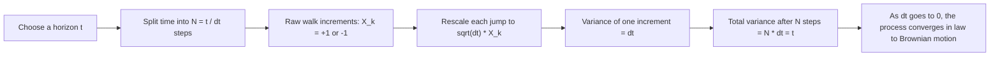

# Brownian Motion, Wiener Process, and Itô Calculus

## 1. Why this chapter matters

Many quantitative finance models are built on the idea that market variables evolve randomly through time.  
A risk engine does not always need a stochastic model for deterministic sensitivities such as PV01 or scenario shocks, but it **does** need one for many simulation-based tasks:

- Monte Carlo pricing
- exposure simulation
- model-based VaR and expected shortfall
- stochastic scenario generation
- diffusion-based models for rates, FX, equities, and credit intensities

The mathematical object that appears again and again is **Brownian motion**, also called the **Wiener process**.

The physical intuition comes from the historical study of small particles suspended in a fluid whose irregular motion was later explained by incessant molecular collisions. The mathematical model abstracts that erratic behavior into an idealized stochastic process with precise probabilistic properties.

---

## 2. From random walks to Brownian motion

A good way to understand Brownian motion is to begin with a **discrete random walk** and ask what kind of scaling can produce a meaningful continuous-time limit.

### 2.1 A simple symmetric random walk

Let

$$
X_k =
\begin{cases}
+1 & \text{with probability } \tfrac12, \\
-1 & \text{with probability } \tfrac12.
\end{cases}
$$

The variables $X_1, X_2, \dots$ are independent and identically distributed, with

$$
\mathbb{E}[X_k] = 0,
\qquad
\operatorname{Var}(X_k) = 1.
$$

After $n$ steps, the position is

$$
S_n = X_1 + X_2 + \cdots + X_n.
$$

This is the classical **simple symmetric random walk**. Since the increments are centered and independent,

$$
\mathbb{E}[S_n] = 0,
\qquad
\operatorname{Var}(S_n) = n.
$$

So the typical size of $S_n$ is of order $\sqrt{n}$. This square-root growth is the first hint of Brownian scaling.

### 2.2 Introducing a time step $\Delta t$

Now suppose that one step takes time $\Delta t$. If we observe the walk up to time $t$, then the number of steps is approximately

$$
N = \frac{t}{\Delta t}.
$$

We now ask: **how large should each spatial jump be** if we want the process to have a sensible limit as $\Delta t \to 0$?

Write the rescaled process as

$$
W_t^{(\Delta t)} = \sum_{k=1}^{\lfloor t/\Delta t \rfloor} a_{\Delta t} X_k,
$$

where $a_{\Delta t}$ is the jump size.

Because the $X_k$ are independent with variance $1$,

$$
\operatorname{Var}\left(W_t^{(\Delta t)}\right)
= \left\lfloor \frac{t}{\Delta t} \right\rfloor a_{\Delta t}^2
\approx \frac{t}{\Delta t} a_{\Delta t}^2.
$$

For a non-degenerate limit, we want this variance to stay of order $t$ as $\Delta t \to 0$. Therefore we must choose

$$
a_{\Delta t}^2 \asymp \Delta t,
$$

which leads to the canonical scaling

$$
a_{\Delta t} = \sqrt{\Delta t}.
$$

So the natural candidate is

$$
W_t^{(\Delta t)} = \sum_{k=1}^{\lfloor t / \Delta t \rfloor} \sqrt{\Delta t}\, X_k.
$$

This explains **why the factor is $\sqrt{\Delta t}$ rather than $\Delta t$ or $1$**.

### 2.3 Why not another power of $\Delta t$?

Suppose more generally that we chose

$$
a_{\Delta t} = (\Delta t)^\alpha.
$$

Then

$$
\operatorname{Var}\left(W_t^{(\Delta t)}\right)
\approx \frac{t}{\Delta t} (\Delta t)^{2\alpha}
= t (\Delta t)^{2\alpha - 1}.
$$

Now let $\Delta t \to 0$:

- if $\alpha > \tfrac12$, then $(\Delta t)^{2\alpha-1} \to 0$, so the process collapses to something trivial;
- if $\alpha < \tfrac12$, then $(\Delta t)^{2\alpha-1} \to \infty$, so the fluctuations blow up;
- only when $\alpha = \tfrac12$ do we get a finite, non-trivial limit.

So the exponent $\tfrac12$ is forced by the requirement that the variance at time $t$ remain proportional to $t$.

### 2.4 Intuition from the central limit theorem

At fixed time $t$, the quantity

$$
W_t^{(\Delta t)} = \sqrt{\Delta t} \sum_{k=1}^{\lfloor t/\Delta t \rfloor} X_k
$$

can be rewritten as

$$
W_t^{(\Delta t)}
= \sqrt{\frac{\lfloor t/\Delta t \rfloor}{1/\Delta t}} \,
\frac{1}{\sqrt{\lfloor t/\Delta t \rfloor}} \sum_{k=1}^{\lfloor t/\Delta t \rfloor} X_k.
$$

As $\Delta t \to 0$, the number of steps goes to infinity. By the **central limit theorem**,

$$
\frac{1}{\sqrt{n}} \sum_{k=1}^n X_k
\Rightarrow \mathcal{N}(0,1).
$$

Since $n \approx t/\Delta t$, this suggests

$$
W_t^{(\Delta t)} \Rightarrow \mathcal{N}(0,t).
$$

That already matches one of the defining properties of Brownian motion: at time $t$, the distribution should be Gaussian with mean $0$ and variance $t$.

### 2.5 From finite-dimensional convergence to a process limit

Matching the marginal distribution at one time is not enough. We want the **entire path-valued process** to converge. The precise theorem is the functional central limit theorem, also called **Donsker's invariance principle**:

$$
W_t^{(\Delta t)}
= \sum_{k=1}^{\lfloor t/\Delta t \rfloor} \sqrt{\Delta t} \, X_k
\Longrightarrow W_t,
$$

where $W_t$ is standard Brownian motion.

This means that when time is refined and jumps are shrunk by the factor $\sqrt{\Delta t}$, the random walk converges to a continuous-time Gaussian process with independent increments.

### 2.6 A step-by-step variance check

It is useful to see the variance computation explicitly.

For independent centered increments,

$$
\operatorname{Var}\left(\sum_{k=1}^N Y_k\right)
= \sum_{k=1}^N \operatorname{Var}(Y_k).
$$

Here each increment is

$$
Y_k = \sqrt{\Delta t} X_k,
$$

so

$$
\operatorname{Var}(Y_k) = \Delta t \operatorname{Var}(X_k) = \Delta t.
$$

If we take $N = t/\Delta t$ steps, then

$$
\operatorname{Var}\left(\sum_{k=1}^{t/\Delta t} \sqrt{\Delta t} X_k\right)
= \frac{t}{\Delta t} \cdot \Delta t
= t.
$$

That is exactly the variance growth we want for Brownian motion.

### 2.7 A concrete numerical example

Take $t=1$ year and suppose we discretize into $4$ equal steps, so

$$
\Delta t = 0.25,
\qquad
\sqrt{\Delta t} = 0.5.
$$

Assume one realization of the random walk increments is

$$
X_1 = +1,
\quad X_2 = -1,
\quad X_3 = +1,
\quad X_4 = +1.
$$

Then the rescaled path values are

$$
W_{0.25}^{(\Delta t)} = 0.5,
$$

$$
W_{0.50}^{(\Delta t)} = 0.5 - 0.5 = 0,
$$

$$
W_{0.75}^{(\Delta t)} = 0 + 0.5 = 0.5,
$$

$$
W_{1.00}^{(\Delta t)} = 0.5 + 0.5 = 1.0.
$$

If we refine the partition, the path becomes more jagged, but the variance at time $1$ remains of order $1$ because each individual jump gets smaller like $\sqrt{\Delta t}$.

### 2.8 Visual intuition

The scaling logic can be summarized as follows.

Another way to picture it is:

- more time steps means **more shocks**;
- but each shock must be **smaller**;
- the only scaling that preserves the correct total fluctuation is $\sqrt{\Delta t}$.

### 2.9 What survives in the limit?

In the limit, three structural properties emerge:

1. **independent increments** come from independence of the $X_k$;
2. **Gaussian increments** come from the central limit theorem;
3. **variance proportional to elapsed time** comes from the $\sqrt{\Delta t}$ scaling.

Those are precisely the features that define Brownian motion.

### 2.10 Historical and mathematical perspective

Historically, Brownian motion comes from the observed irregular motion of microscopic particles suspended in a fluid. The physical explanation is that the particle is constantly hit by surrounding molecules. The mathematical model does not describe each collision individually; instead, it passes to an idealized limit in which only the aggregate random effect remains.

That idealized limit is the **Wiener process**, which is the canonical continuous-time model of Brownian motion in probability theory, stochastic calculus, and mathematical finance.

---

## 3. What is a Wiener process?

A **standard Wiener process** $W_t$ is a stochastic process satisfying:

1. $W_0 = 0$
2. it has **independent increments**
3. for $0 \le s < t$, the increment $W_t - W_s$ is Gaussian:
   $$
   W_t - W_s \sim \mathcal{N}(0, t-s)
   $$
4. sample paths are continuous almost surely

In mathematical finance, the terms **Wiener process** and **Brownian motion** are often used interchangeably.

### Intuition

For a small interval $\Delta t$,

$$
W_{t+\Delta t} - W_t \sim \mathcal{N}(0, \Delta t).
$$

So the increment has:

- mean $0$
- variance $\Delta t$
- standard deviation $\sqrt{\Delta t}$

This is why in simulation we often write

$$
\Delta W \approx \sqrt{\Delta t} \, Z,
\qquad
Z \sim \mathcal{N}(0,1).
$$

### Example

Suppose $\Delta t = 1/252$, representing one trading day. Then

$$
\Delta W \sim \mathcal{N}\left(0, \frac{1}{252}\right)
$$

and a simulated increment is

$$
\Delta W = \sqrt{\tfrac{1}{252}}\, Z.
$$

If $Z = 0.5$, then

$$
\Delta W \approx \frac{0.5}{\sqrt{252}} \approx 0.0315.
$$

The path itself is wildly irregular. In fact, Brownian paths are continuous but nowhere differentiable almost surely.

---

## 4. Brownian motion as a model ingredient

Brownian motion by itself is centered around zero and has no drift. Most financial quantities need a drift and a scale. This leads to processes of the form

$$
X_t = X_0 + \mu t + \sigma W_t.
$$

Then

$$
X_t \sim \mathcal{N}(X_0 + \mu t, \sigma^2 t).
$$

This is called an **arithmetic Brownian motion**.

### Example: short-rate style factor

A simple factor could be

$$
r_t = r_0 + \mu t + \sigma W_t.
$$

This means the rate level changes additively over time. It can be useful as a simple teaching model, but it can also produce unrealistic negative or explosive behavior depending on parameters.

---

## 5. Geometric Brownian motion

A standard equity-style model is the **geometric Brownian motion**:

$$
dS_t = \mu S_t \, dt + \sigma S_t \, dW_t.
$$

The solution is

$$
S_t = S_0 \exp\left(\left(\mu - \tfrac12 \sigma^2\right)t + \sigma W_t\right).
$$

This guarantees $S_t > 0$.

### Why this matters

- it is the standard starting point for Black–Scholes
- it explains why log-returns are Gaussian in the simplest model
- it is a natural example for Itô's formula

### Example

Let

$$
S_0 = 100,
\qquad
\mu = 5\%,
\qquad
\sigma = 20\%,
\qquad
t = 1.
$$

If one realization of the Brownian motion is $W_1 = 0.3$, then

$$
S_1 = 100 \exp\left((0.05 - 0.5 \cdot 0.2^2) \cdot 1 + 0.2 \cdot 0.3\right)
= 100 \exp(0.09)
\approx 109.42.
$$

---

## 6. What is an Itô process?

An **Itô process** is a process of the form

$$
dX_t = a(t, X_t)\, dt + b(t, X_t)\, dW_t.
$$

Here:

- $a(t,X_t)$ is the **drift**
- $b(t,X_t)$ is the **diffusion** or local volatility scale
- $dW_t$ is the Brownian increment

This compact notation says:

- the process has a deterministic local tendency through $a \, dt$
- it also has random local shocks through $b \, dW_t$

Many financial models can be written this way.

### Examples

#### Arithmetic Brownian motion

$$
dX_t = \mu \, dt + \sigma \, dW_t.
$$

#### Geometric Brownian motion

$$
dS_t = \mu S_t \, dt + \sigma S_t \, dW_t.
$$

#### Ornstein–Uhlenbeck / mean reversion

$$
dX_t = \kappa(\theta - X_t)\, dt + \sigma \, dW_t.
$$

This is useful for rates or spread-factor intuition because the process tends to revert toward $\theta$.

---

## 7. Itô's formula: the stochastic chain rule

If $X_t$ follows

$$
dX_t = a(t,X_t)\, dt + b(t,X_t)\, dW_t,
$$

and $f(t,x)$ is smooth enough, then

$$
df(t,X_t)
=
\left(
\frac{\partial f}{\partial t}
+ a \frac{\partial f}{\partial x}
+ \frac12 b^2 \frac{\partial^2 f}{\partial x^2}
\right) dt
+
 b \frac{\partial f}{\partial x} \, dW_t.
$$

This is the stochastic analog of the ordinary chain rule, but with an extra second-derivative term.

### Why does the extra term appear?

Because in stochastic calculus,

$$
(dW_t)^2 = dt,
\qquad
dW_t\,dt = 0,
\qquad
(dt)^2 = 0.
$$

The quadratic variation of Brownian motion is nontrivial, and that changes the calculus.

---

## 8. Step-by-step example of Itô's formula

Take geometric Brownian motion:

$$
dS_t = \mu S_t \, dt + \sigma S_t \, dW_t.
$$

Let us apply Itô's formula to

$$
f(S_t) = \ln S_t.
$$

We have

$$
f'(x) = \frac{1}{x},
\qquad
f''(x) = -\frac{1}{x^2}.
$$

Itô's formula gives

$$
d\ln S_t
= f'(S_t) \, dS_t + \frac12 f''(S_t) (dS_t)^2.
$$

Substitute:

$$
d\ln S_t
= \frac{1}{S_t}(\mu S_t \, dt + \sigma S_t \, dW_t)
+ \frac12 \left(-\frac{1}{S_t^2}\right)(\sigma^2 S_t^2 \, dt).
$$

So

$$
d\ln S_t = \left(\mu - \frac12 \sigma^2\right) dt + \sigma dW_t.
$$

Integrating from $0$ to $t$,

$$
\ln S_t - \ln S_0
= \left(\mu - \frac12 \sigma^2\right)t + \sigma W_t,
$$

hence

$$
S_t = S_0 \exp\left(\left(\mu - \tfrac12 \sigma^2\right)t + \sigma W_t\right).
$$

This is one of the most important textbook examples in mathematical finance.

---

## 9. Multidimensional Brownian motion

In practice, portfolios depend on many risk factors, not one. Then we use a vector Brownian motion:

$$
\mathbf{W}_t = (W_t^{(1)}, \dots, W_t^{(n)}).
$$

The dynamics become

$$
d\mathbf{X}_t = \mathbf{a}(t,\mathbf{X}_t)\, dt + B(t,\mathbf{X}_t)\, d\mathbf{W}_t,
$$

where $B$ is a loading matrix.

If the Brownian motions are correlated, one common implementation is:

1. simulate independent standard normals $Z \sim \mathcal{N}(0, I)$
2. compute a Cholesky factor $L$ of the covariance or correlation matrix
3. set
   $$
   Y = LZ
   $$
   so that $Y$ has the desired covariance structure

This is directly relevant for multi-factor Monte Carlo in rates, FX, equities, and credit.

---

## 10. Brownian motion in different asset classes

### Rates

Short-rate models and factor models often use Brownian drivers:

$$
dr_t = \kappa(\theta - r_t)dt + \sigma dW_t.
$$

### FX

A simple model for spot FX under a domestic risk-neutral measure might be

$$
\frac{dS_t}{S_t} = (r_d - r_f)dt + \sigma dW_t.
$$

### Equities

Black–Scholes uses geometric Brownian motion.

### Credit

Reduced-form intensity models often use a stochastic intensity $\lambda_t$, for example

$$
d\lambda_t = \kappa(\theta - \lambda_t)dt + \sigma \sqrt{\lambda_t} \, dW_t,
$$

or spread-factor models driven by Gaussian or mean-reverting processes.

### Commodities

Spot or forward factors can be modeled with one or several Brownian drivers, sometimes with seasonality and convenience-yield components.

---

## 11. From theory to implementation

A risk engine should not hard-code stochastic models into the pricing code. A clean architecture separates:

1. **market-state construction**
2. **deterministic pricing/risk**
3. **stochastic factor model**
4. **simulation engine**
5. **aggregation and reporting**

For simulation, the generic Euler step is

$$
X_{t+\Delta t} \approx X_t + a(t,X_t)\Delta t + b(t,X_t)\sqrt{\Delta t} Z,
\qquad Z \sim \mathcal{N}(0,1).
$$

In C++, this should live in a dedicated Monte Carlo or stochastic-model module, not in the deterministic valuation service.

---

## 12. Common pitfalls

### Confusing physical and risk-neutral dynamics

The drift under the real-world probability measure $\mathbb{P}$ is not generally the same as the drift under the pricing measure $\mathbb{Q}$.

### Using Brownian motion where jumps dominate

Brownian motion is continuous. It does not model default jumps, gap risk, or discontinuous events well by itself.

### Overusing sophisticated models too early

For a production-shaped demo platform, it is usually better to implement:

- deterministic pricing and deterministic shocks first
- simple stochastic factor simulation second
- advanced model families later

---

## 13. Summary

Brownian motion, or the Wiener process, is the canonical continuous-time source of randomness in quantitative finance.  
Starting from random walks, it leads naturally to Itô processes of the form

$$
dX_t = a(t,X_t)dt + b(t,X_t)dW_t.
$$

Itô's formula then tells us how functions of stochastic processes evolve, adding the crucial correction term

$$
\frac12 b^2 f_{xx} dt.
$$

These ideas underpin Monte Carlo simulation, diffusion models, and much of modern pricing and risk theory.

---

## 14. Suggested implementation takeaways for this project

For the **Quant Risk Platform**:

- keep deterministic and stochastic analytics separate
- support a reusable random-number and path-generation layer
- start with low-dimensional factor simulation
- document the measure, calibration assumptions, and discretization method clearly
- expose final reports, not raw stochastic internals, through Python bindings
